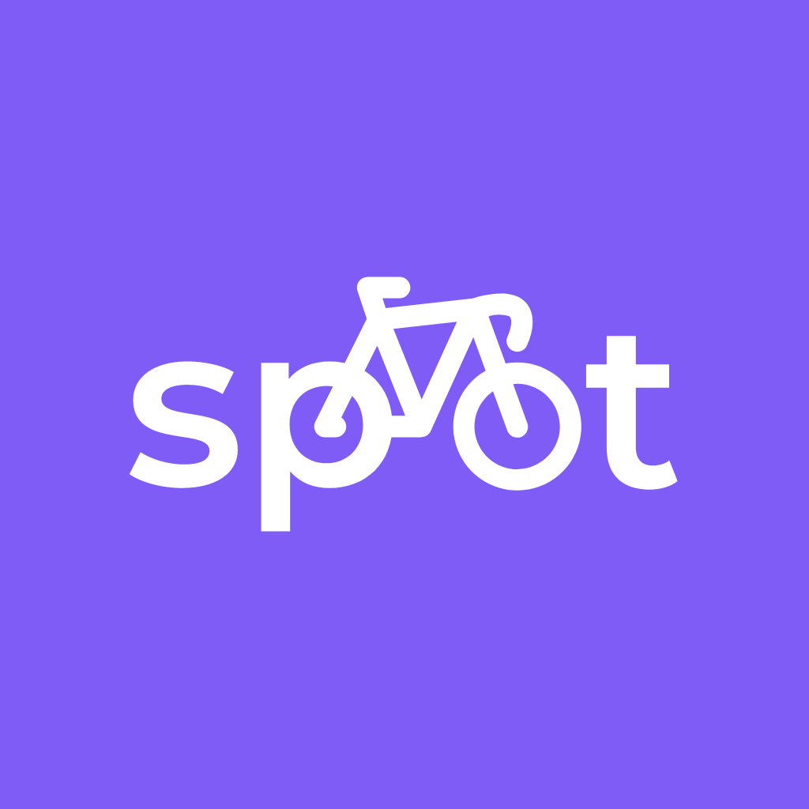

<h1 align="center">
  <br>
  
  <br>
  Projet Spot
  <br>
</h1>

<h4 align="center" >Mattis Simon | Yann Furrer | Juliette Ferey</h4>

<p align="center">
  [](https://shields.io/)

</p>

## Key Features

* Cross platform
  - Android and IOS.
* RealTime localisation

## How To Use

To clone and run this application, you'll need to install on your computer :
* [Git](https://git-scm.com)
* [Node.js](https://nodejs.org/en/download/) (which comes with [npm](http://npmjs.com)) 
* [Expo](https://docs.expo.dev/)

From your command line:

```bash
# Clone this repository
$ git clone https://github.com/chourabieure/Projet_Spot

# Go into the repository
$ cd Projet_Spot

# Install dependencies
$ npm install

# Run the app
$ expo start
```

## Credits

This software uses the following open source packages:

- [NodeJs](https://nodejs.org/)
- [ExpressJs](https://expressjs.com/)
- [Expo](https://docs.expo.dev/)
- [PythoDB](https://www.mongodb.com/)


## License

Epitech DIGITAL

---
